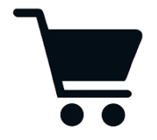
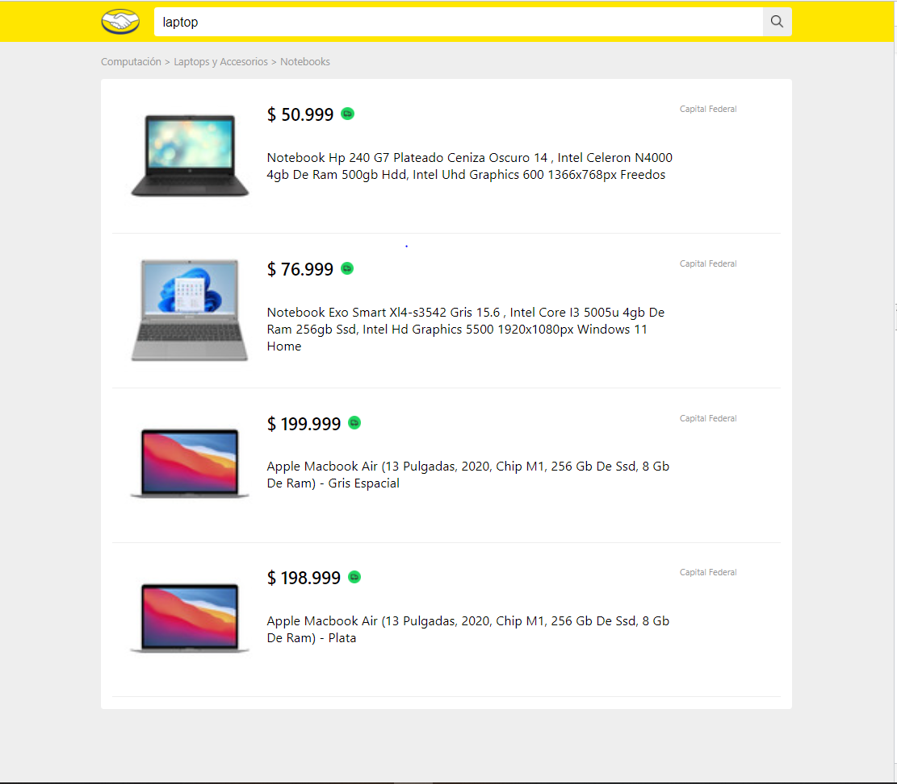
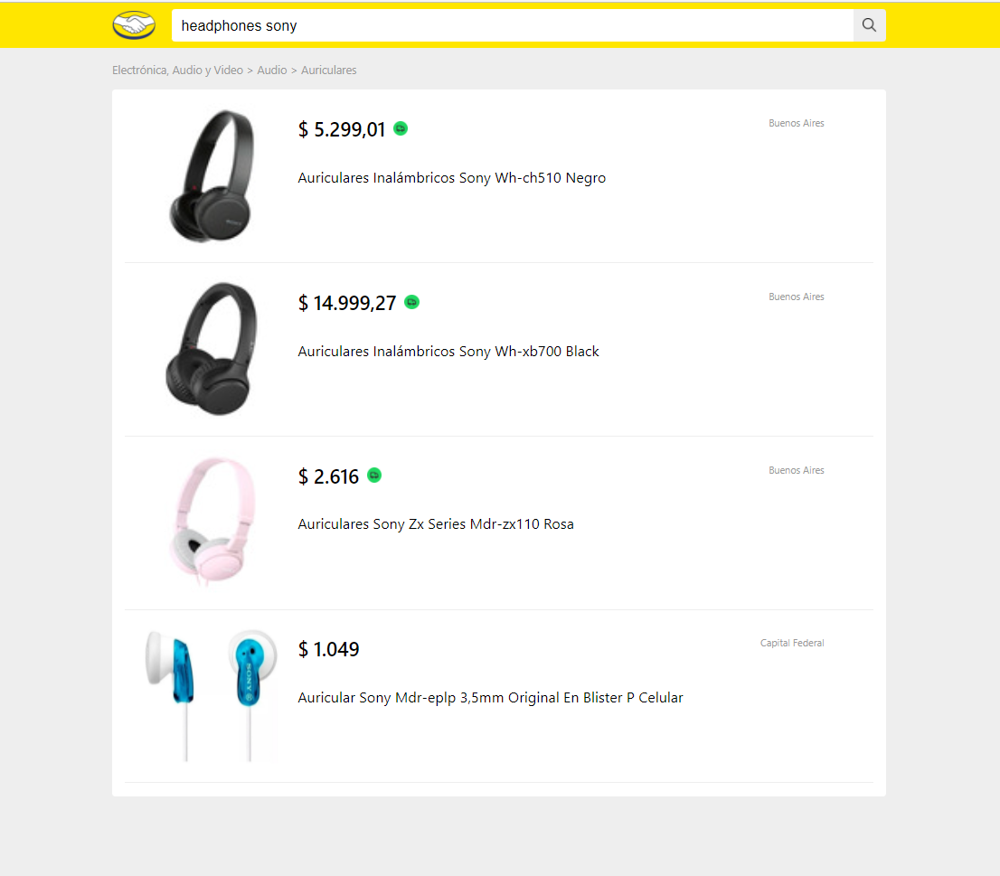
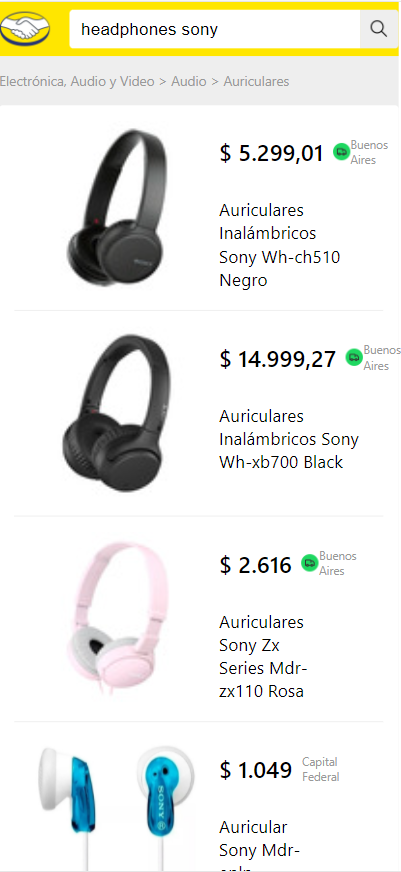
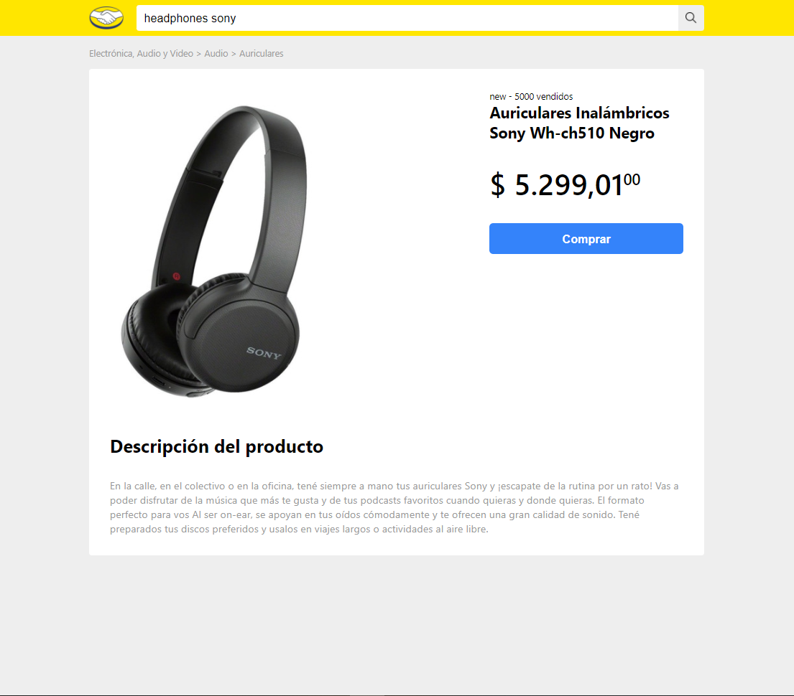

<div id="top"></div>

<br />
<div align="center">
  
  

  <h3 align="center">Merc App</h3>

  <p align="center">
    Consult Products, prices and details
    <br />
  </p>
</div>


<!-- TABLE OF CONTENTS -->
<details>
  <summary>Table of contents</summary>
  <ol>
    <li>
      <a href="#about-the-project">About The Project</a>
      <ul>
        <li><a href="#built-with">Built With</a></li>
      </ul>
    </li>
    <li>
      <a href="#getting-started">Getting Started</a>
      <ul>
        <li><a href="#prerequisites">Prerequisites</a></li>
        <li><a href="#installation">Installation</a></li>
      </ul>
    </li>
    <li><a href="#usage">Usage</a></li>
  </ol>
</details>


<!-- ABOUT THE PROJECT -->
## About The Project



Merc App is an E-commerce project that allows the user to consult different products, their prices and details. This project consists of two parts and in this repository you can find the FrontEnd part of the project.
### Built With

* [React.js](https://reactjs.org/)
* [React Router V6](https://reactrouter.com/)
* [Sass](https://sass-lang.com/)

<p align="right">(<a href="#top">back to top</a>)</p>


<!-- GETTING STARTED -->
## Getting Started

### Prerequisites

* Install Npm
  ```sh
  https://www.npmjs.com/
  ```

### Installation and Server Activation


1. Clone the repo
   ```sh
   git clone git@github.com:JuanMercApp/merc-front.git
   ```
2. Install NPM packages
   ```sh
   npm install
   ```
3. Run server
   ```sh
   npm start
   ```

<p align="right">(<a href="#top">back to top</a>)</p>


<!-- USAGE EXAMPLES -->
## Usage

The application consists of 2 main views:
1.  The search view where you can see the detail of several products (At the moment you can only see 4 but you can modify the code to show all the products received).

### Desktop

<br />

### Mobile

<br />

2. The product detail view where you can access the product.
### Desktop


### Mobile

<br />
To use the application it will be necessary that the backend is also running.

<p align="right">(<a href="#top">back to top</a>)</p>